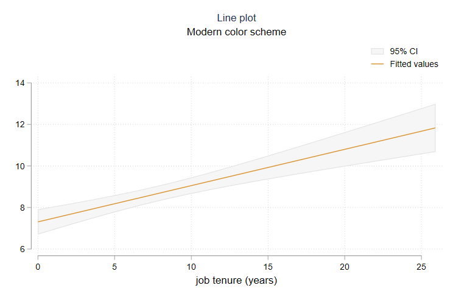

allston
=================================

[Overview](#overview)
| [Installation](#installation)
| [Screenshots](#screenshots)
| [To-Do](#todo)
| [Acknowledgements](#acknowledgements)

Pretty graphical schemes to replace Stata defaults

Overview
---------------------------------

Stata's default graphics don't look that good. This program provides three replacement schemes that look better. You can check out some pictures of what these schemes look like in the [Screenshots](#screenshots) section below. 

Installation
---------------------------------

Installing and using these schemes is straightforward.

1. Install both packages from this GitHub repository by typing the following command at the command line:

```stata
net install allston, from("https://raw.githubusercontent.com/dballaelliott/allston/master/")
```

1. To use the light-colored theme, type:
```stata
set scheme allston, perm
```

1. To use the [frost](https://www.nordtheme.com/docs/colors-and-palettes#frost) theme, type:
```stata
set scheme frost, perm
```


1. To use the [aurora](https://www.nordtheme.com/docs/colors-and-palettes#aurora) theme instead, simply type:
```stata
set scheme aurora, perm
```


Screenshots
---------------------------------


<details>

<summary>Click for histogram example</summary>

")


</details>
<details>
<summary>Click for scatterplot example</summary>

")


</details>
<details>
<summary>Click for bar chart example</summary>

")


</details>
<details>
<summary>Click for binned scatterplot example</summary>

")


</details>
<details>
<summary>Click for line plot example</summary>

")




</details>


Acknowledgements
---------------------------------
The excellent [Nord palette](https://www.nordtheme.com) is the foundation of the `frost` and `aurora`

These schemes were built by combining elements from two existing schemes: (1) the leap-slides used by the Opportunity Insights research group from 2015 to present; (2) the [cleanplots](https://www.trentonmize.com/software/cleanplots) scheme produced by Trenton D. Mize.

Interested users might also like to check out other work; for instance, the [grstyle](https://boris.unibe.ch/117391/1/grstyle-Konstanz-2018.pdf) command by Ben Jann.
